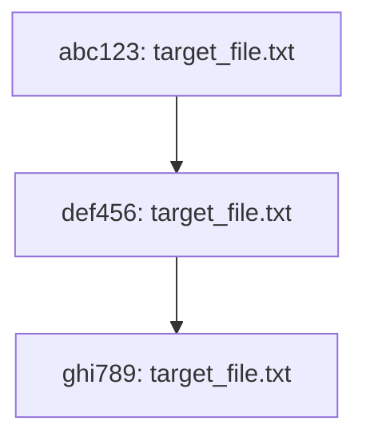

# Dependency Visualizer Tests

## Описание

Этот проект предоставляет тесты для **Dependency Visualizer**, инструмента командной строки, который строит граф зависимостей для файлов в Git-репозитории. Тесты создают временный Git-репозиторий, проверяют ключевые функции инструмента и сохраняют результаты тестов.

## Как работает

- **Тесты** проверяют функциональность:
  1. Получение списка коммитов, связанных с файлом.
  2. Извлечение файлов, изменённых в коммитах.
  3. Построение графа в формате Mermaid.
  4. Сохранение графа в файл.

- Тесты используют временный Git-репозиторий для изоляции. После выполнения тестов все временные файлы удаляются, **кроме файла с графом (`output.mmd`)**, который сохраняется для анализа.

---

## Использование

### 1. Настройка

Убедитесь, что `dependency_visualizer.py` находится в той же директории, что и тесты.

### 2. Запуск приложения
```bash
python dependency_visualizer.py --repo-path C:\Users\admin\Documents\Sashenka_Konfig --file-name target_file.txt --output-path output.mmd
```
где:
dependency_visualizer.py — это имя вашего Python-скрипта.
--repo-path "/path/to/your/repo" — путь к вашему git-репозиторию.
--file-name "example.txt" — имя файла, для которого вы хотите построить граф.
--output-path "output_graph.mmd" — путь к файлу, куда будет сохранён граф в формате Mermaid.
### 3. Запуск тестов

Запустите файл тестов через терминал:

```bash
python test_dependency_visualizer.py
```
### 3. Результат
При успешном прохождении тестов вы увидите:
```plaintext
Setting up test repository...
Test repository set up.
Running test_get_git_commits_with_file...
✅ Passed
Running test_get_commit_files...
✅ Passed
Running test_build_mermaid_graph...
✅ Passed
Running test_save_graph_to_file...
✅ Passed
✅ Все тесты прошли успешно!
Cleaning up...
Удалён временный тестовый репозиторий: test_repo
Файл графа сохранён и не будет удалён: output.mmd
Файл output.mmd сохраняется в директории для дальнейшего анализа.
```
Структура проекта
```plaintext
.
├── dependency_visualizer.py    # Основной скрипт Dependency Visualizer
├── test_dependency_visualizer.py # Тесты для проверки функциональности
├── output.mmd                  # Файл с результатом графа (создаётся тестами)
Функции тестов
1. test_get_git_commits_with_file
Проверяет, что функция возвращает правильный список коммитов для указанного файла.
2. test_get_commit_files
Проверяет, что функция извлекает список файлов, изменённых в конкретном коммите.
3. test_build_mermaid_graph
Проверяет, что функция строит корректный граф в формате Mermaid.
4. test_save_graph_to_file
Проверяет, что граф сохраняется в файл.
Особенности
Временный репозиторий создаётся в папке test_repo и удаляется после завершения тестов.
Файл output.mmd сохраняется для анализа и не удаляется автоматически.

После выполнения тестов файл output.mmd содержит граф зависимостей в формате Mermaid:

Этот файл можно загрузить в Mermaid Live Editor для визуализации.